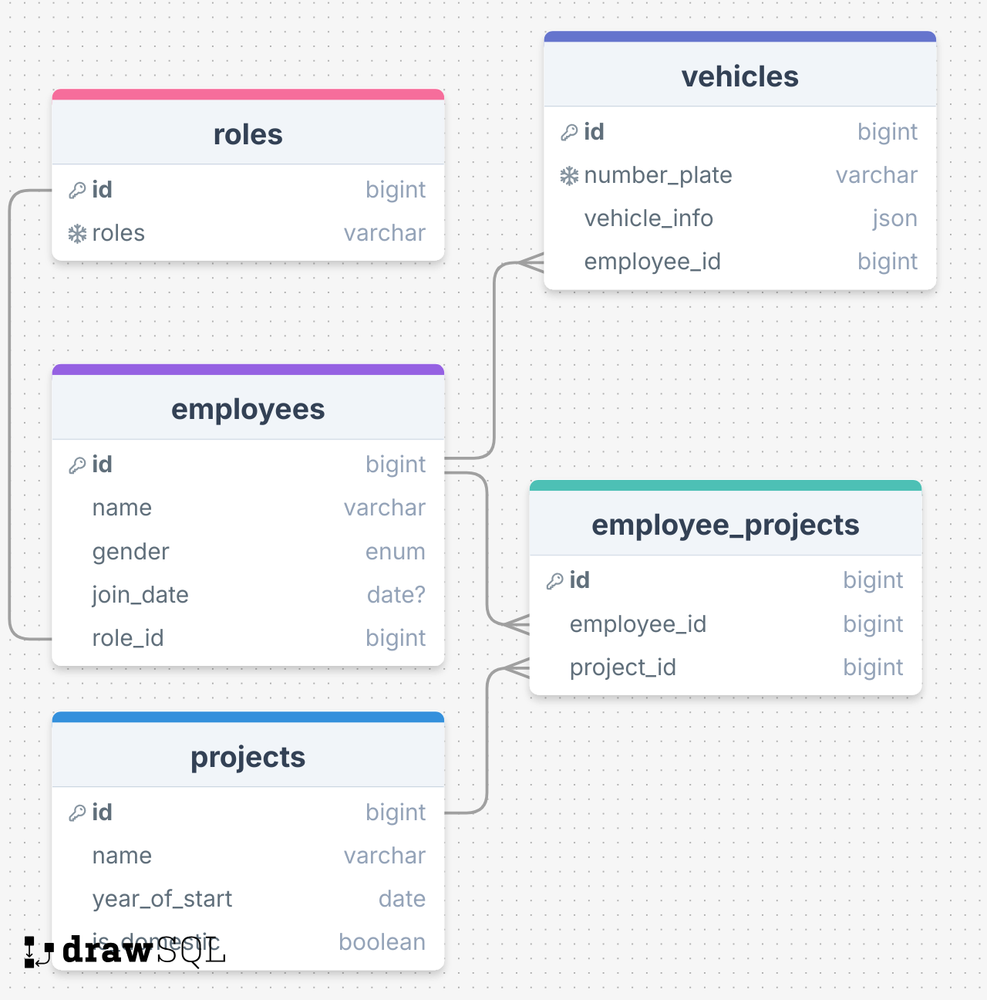

# About YI-IS-api 
Purpose: To manage employee information for YI via an API system.
Key Features:
Role-based employee management.
Tracking employee vehicles.
Associating employees with multiple projects.

---

# DB Diagram 

---

## Database Structure & Relationship

Key Relationships:
1. Roles Table
  - Relationship:
      - One-to-One with the Employees Table.

2. Employees Table
  - Relationship:
      - Belongs To the Roles Table: Links an employee to their specific role.
      - One-to-Many with the Vehicles Table: Tracks vehicles associated with the employee.
      - One-to-Many with the Employee_Projects Table: Connects employees to their projects.

3. Vehicles Table
  - Relationship:
    - Belongs To the Employees Table: Maps a vehicle to its owner.

4. Projects Table
  - Relationship:
      - One-to-Many with the Employee_Projects Table: Associates multiple employees with a project.

5. Employee_Projects Table
  - Relationship:
       - Belongs To the Employees Table: Links an employee to projects.
       - Belongs To the Projects Table: Links a project to employees.
